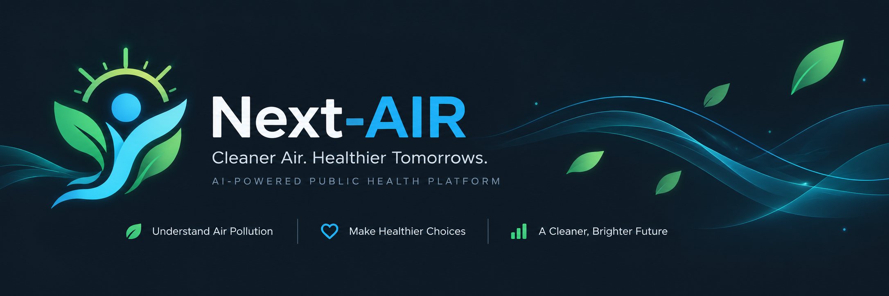
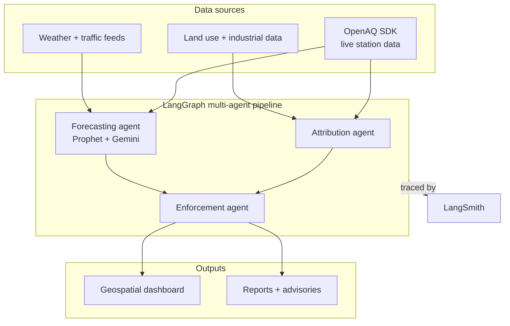

# Next-AIR

> **1.67 million Indians die from air pollution every year.**
> We know it's bad. Nobody can explain *why* — or *what to do next*.
> **Next-AIR changes that.**

A multi-agent AI platform that turns AQI numbers into **causes**, **actions**, and **accountability**.

---

## The Problem

- **900+ monitoring stations** across India. Only **31% of cities** have any response protocol linked to the data. *(CAG Audit, 2024)*
- City officials see `AQI: 218 — Poor`. They don't see *why*, *where*, or *what to do*.
- Communities breathe dangerous air in silence — the link between **data → cause → accountability** is missing.

---

## What Next-AIR Does

| When air gets dangerous... | Next-AIR answers |
|---|---|
| 🔴 **What's happening?** | Live AQI + pollutant breakdown by neighbourhood |
| 🔍 **Why is it happening?** | Attribution across traffic, construction, weather, and industrial sources — with confidence scores |
| 📈 **What happens next?** | 24–72 hour hyperlocal AQI forecast |
| 🏥 **Who is at risk?** | Schools, hospitals, outdoor workers — mapped and prioritised |
| ⚡ **What should be done?** | Ranked, evidence-backed enforcement actions ready for human review |

---

## Architecture

Three data streams. Three parallel AI agents. One coordinated action.



| Agent | Role |
|---|---|
| **Attribution Agent** | Matches pollution spikes to likely sources with statistical confidence |
| **Forecasting Agent** | Prophet + Gemini, 24–72h ward-level AQI prediction |
| **Enforcement Agent** | Turns findings into prioritised, human-reviewed action cards |

Every recommendation is **traceable** — source, timestamp, confidence score, and human decision are all logged.

---

## Built With


---

## Demo

> *From signal to action in under 10 seconds.*

<!-- Replace the line below with:  once you have the recording -->
**→ Add `demo.gif` here** — neighbourhood selected → agents fire in parallel → evidence card + enforcement action appears.

---

## What Makes It Different

1. **Explains causes, not just conditions** — most tools stop at AQI. Next-AIR identifies *what* is driving it.
2. **Honest about uncertainty** — every claim shows its source, confidence level, and what's missing.
3. **Closes the loop** — recommendations go to officials, outcomes are tracked, the system learns from every decision.

---

## In Practice

> A school in Andheri records three consecutive days of PM2.5 above 150. Next-AIR identifies heavy construction 400m away as the likely source with 78% confidence, flags it for municipal inspection, and recommends a temporary suspension of outdoor activities. The inspector confirms the site. Activity resumes two days later.

---

## Quick Start

```bash
git clone https://github.com/your-username/next-ai
cd next-ai
cp .env.example .env        # add your API keys
pip install -r requirements.txt
python main.py --ward "Andheri West"
```

→ See [docs/getting_api_keys.md](docs/getting_api_keys.md) for key setup.

---

[Docs](docs/problem_statement.md) · [Architecture](docs/architecture.md) · [Problem Statement](docs/problem_statement.md) · [Contributing](CONTRIBUTING.md) · [License](LICENSE)

---

<p align="center">
  <em>Next-AIR — measure the problem · explain the cause · show the evidence · demand the response · protect human health</em>
</p>
