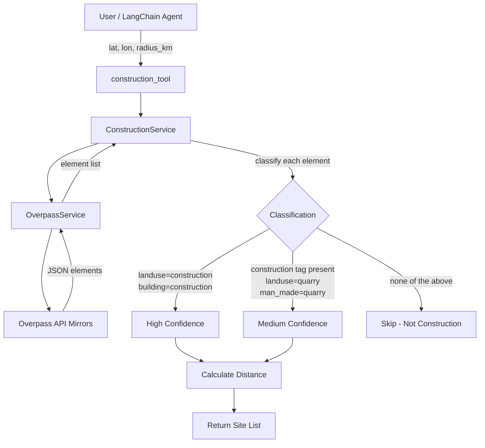
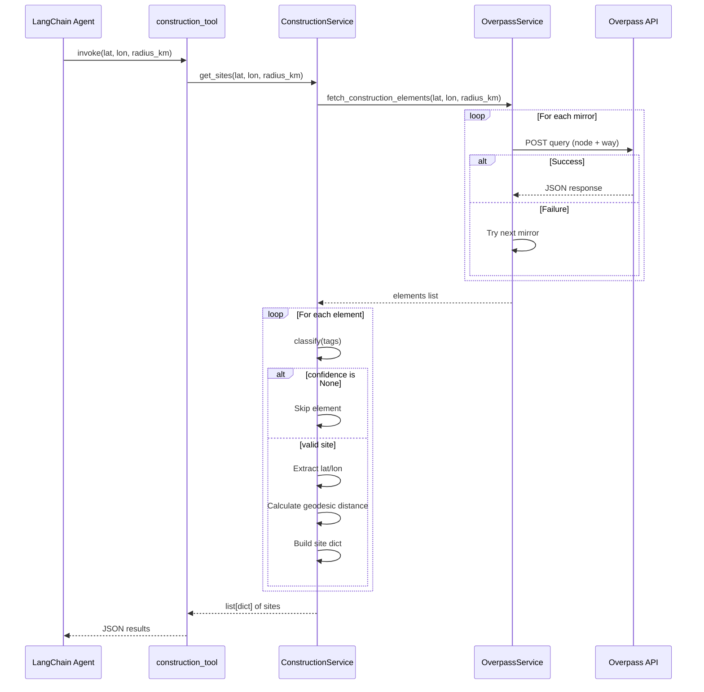
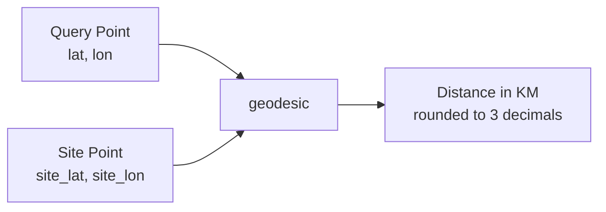
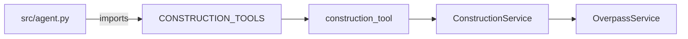

# Construction Site Detection Tool

## Overview

This module detects nearby construction sites for a given location using OpenStreetMap data. It queries the Overpass API for construction-tagged elements, classifies them by confidence level, and returns structured results with distance calculations.

---

## Architecture



---

## Process Flow



---

## Components

### 1. `construction_tool` (LangChain Tool)

**File:** `src/construction_tools.py`

Thin wrapper that exposes `ConstructionService` as a LangChain `@tool`.

| Parameter | Type | Default | Description |
|---|---|---|---|
| `lat` | `float` | required | Latitude of the center point |
| `lon` | `float` | required | Longitude of the center point |
| `radius_km` | `float` | `3` | Search radius in kilometers |

**Returns:** `list[dict]` — each dict contains:

| Key | Type | Description |
|---|---|---|
| `site_id` | `str` | OSM element ID (e.g. `"way/123"`) |
| `lat` | `float` | Site latitude |
| `lon` | `float` | Site longitude |
| `confidence` | `str` | `"high"` or `"medium"` |
| `distance_km` | `float` | Distance from query point |
| `source_type` | `str` | Always `"construction"` |
| `tags` | `dict` | Raw OSM tags |

---

### 2. `ConstructionService`

**File:** `src/services/construction_service.py`

Core business logic for fetching and classifying construction sites.

#### Methods

| Method | Type | Description |
|---|---|---|
| `__init__()` | instance | Initializes `OverpassService` client |
| `classify(tags)` | `@staticmethod` | Returns confidence level from OSM tags |
| `get_sites(lat, lon, radius_km)` | instance | Fetches, filters, and returns construction sites |

#### Classification Logic

```mermaid
flowchart TD
    A[OSM Element Tags] --> B{landuse=construction<br/>or building=construction?}
    B -->|Yes| C[Return "high"]
    B -->|No| D{"construction" in tags<br/>or landuse=quarry<br/>or man_made=quarry?}
    D -->|Yes| E[Return "medium"]
    D -->|No| F[Return None - Skip]
```

| Condition | Confidence |
|---|---|
| `landuse = "construction"` | **high** |
| `building = "construction"` | **high** |
| `"construction"` key present in tags | **medium** |
| `landuse = "quarry"` | **medium** |
| `man_made = "quarry"` | **medium** |
| None of the above | Skipped |

---

### 3. `OverpassService`

**File:** `src/services/overpass_service.py`

Handles Overpass API communication with automatic mirror fallback.

#### Mirrors

| Priority | URL |
|---|---|
| 1 | `https://overpass-api.de/api/interpreter` |
| 2 | `https://overpass.kumi.systems/api/interpreter` |
| 3 | `https://overpass.private.coffee/api/interpreter` |

#### Overpass Query

The query searches for construction-tagged elements within the radius:

```
node["landuse"="construction"](around:{r},{lat},{lon})
way["landuse"="construction"](around:{r},{lat},{lon})
node["building"="construction"](around:{r},{lat},{lon})
way["building"="construction"](around:{r},{lat},{lon})
way["construction"](around:{r},{lat},{lon})
```

Where `r = radius_km * 1000` (converted to meters).

---

## Distance Calculation

Uses **geodesic distance** (WGS-84 ellipsoid) via `geopy.distance.geodesic`:



---

## Agent Integration



`CONISTRATION_TOOLS` is registered in `src/agent.py` alongside `CAAQMS_TOOLS` and `traffic_tool`:

```python
from src.construction_tools import CONSTRUCTION_TOOLS

agent = create_agent(
    model=llm,
    tools=[calculator, *CAAQMS_TOOLS, *traffic_tool, *CONSTRUCTION_TOOLS],
)
```

---

## Example Output

```json
[
  {
    "site_id": "way/123456",
    "lat": 28.6139,
    "lon": 77.2090,
    "confidence": "high",
    "distance_km": 1.234,
    "source_type": "construction",
    "tags": {
      "landuse": "construction",
      "name": "Metro Phase 3"
    }
  },
  {
    "site_id": "node/789012",
    "lat": 28.6200,
    "lon": 77.2150,
    "confidence": "medium",
    "distance_km": 2.105,
    "source_type": "construction",
    "tags": {
      "man_made": "quarry"
    }
  }
]
```

---

## Testing

**Test file:** `tests/test_construction_tools.py`

```mermaid
flowchart TD
    A[TestConstructionTool] --> B[test_construction_tool_returns_sites]
    A --> C[test_construction_tool_empty_results]
    A --> D[test_construction_tool_default_radius]
    B --> E[Mock service.get_sites<br/>Assert correct call + result]
    C --> F[Mock service.get_sites → []<br/>Assert empty list returned]
    D --> G[Invoke without radius_km<br/>Assert default=3 used]
```

All tests mock `construction_service` at the import location (`src.construction_tools.construction_service`) to avoid real network calls.

**Run tests:**

```bash
pytest tests/test_construction_tools.py -v
```

---

## Technologies

- **LangChain** — Tool framework (`@tool` decorator)
- **Overpass API** — OpenStreetMap query engine
- **geopy** — Geodesic distance calculation
- **unittest** — Test framework with mocking
- **pytest** — Test runner
