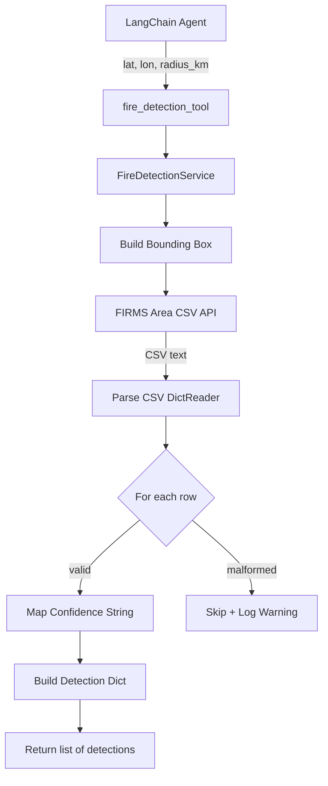
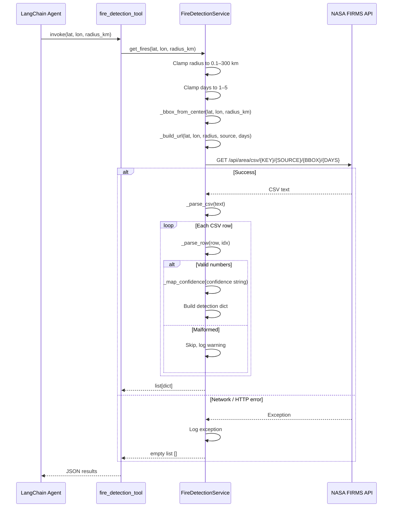
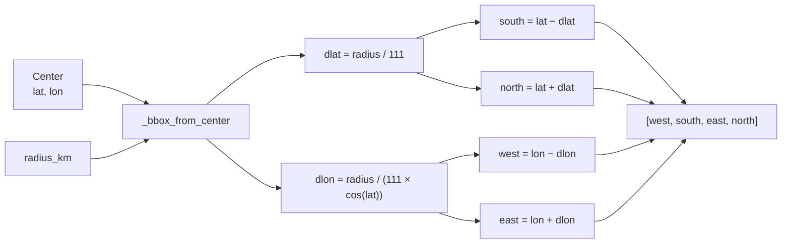
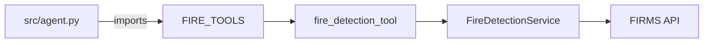
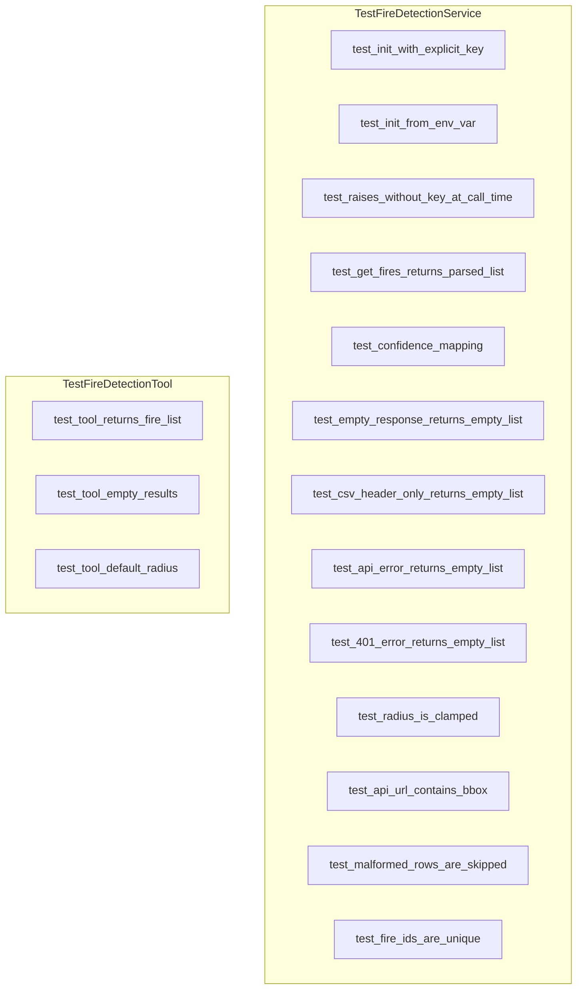

# Fire Detection Tool

## Overview

Detects active fires and thermal hotspots near a given location using NASA FIRMS satellite data. Queries the FIRMS area API for VIIRS sensor detections, parses CSV responses, and returns structured results.

**Files:**
- `src/fire_tools.py` — LangChain `@tool` wrapper
- `src/services/fire_service.py` — `FireDetectionService` class
- `tests/test_fire_tools.py` — 16 unit tests

---

## Architecture



---

## Process Flow



---

## Components

### 1. `fire_detection_tool` (LangChain Tool)

**File:** `src/fire_tools.py`

| Parameter | Type | Default | Description |
|---|---|---|---|
| `lat` | `float` | required | Latitude of the search center |
| `lon` | `float` | required | Longitude of the search center |
| `radius_km` | `float` | `10.0` | Search radius in km (clamped 0.1–300) |

**Returns:** `list[dict]`

---

### 2. `FireDetectionService`

**File:** `src/services/fire_service.py`

#### Public Methods

| Method | Signature | Description |
|---|---|---|
| `__init__` | `(api_key: str \| None)` | Explicit key or reads `FIRMS_API_KEY` env var |
| `get_fires` | `(lat, lon, radius_km, *, source, days)` | Main entry — fetch + parse detections |

#### Internal Methods

| Method | Description |
|---|---|
| `_build_url` | Constructs FIRMS API URL with bounding box |
| `_fetch_csv` | HTTP GET, returns `""` on any failure |
| `_parse_csv` | CSV text → list of dicts via `DictReader` |
| `_parse_row` | One CSV row → dict, or `None` if malformed |
| `_map_confidence` | FIRMS string → numeric percentage |
| `_bbox_from_center` | Center + radius → `[west, south, east, north]` |

#### Confidence Mapping

| FIRMS String | Numeric % |
|---|---|
| `"high"` | 90 |
| `"nom"` / `"nominal"` | 70 |
| `"low"` | 30 |
| *(unknown)* | 50 |

#### Bounding Box Calculation



#### Error Handling

```mermaid
flowchart TD
    A[get_fires] --> B{API key set?}
    B -->|No| C[Raise ValueError]
    B -->|Yes| D[Clamp params]
    D --> E[Build URL]
    E --> F[HTTP GET]
    F -->|Success| G[Parse CSV]
    F -->|Exception| H[Log + return []]
    G --> I{Row valid?}
    I -->|Yes| J[Parse fields + append]
    I -->|No| K[Skip + log warning]
    J --> L[Next row]
    K --> L
    L --> I
    I -->|Done| M[Return list]
```

---

## Detection Dict Schema

Each detection returned by `get_fires` contains:

| Key | Type | Example | Description |
|---|---|---|---|
| `fire_id` | `str` | `"firms_28.61_77.21_0"` | Unique ID |
| `lat` | `float` | `28.6139` | Detection latitude |
| `lon` | `float` | `77.2090` | Detection longitude |
| `frp_mw` | `float` | `45.2` | Fire Radiative Power (MW) |
| `confidence_pct` | `int` | `90` | Confidence (30/50/70/90) |
| `brightness_k` | `float` | `320.5` | Brightness temp (Kelvin) |
| `scan` | `float` | `1.0` | Pixel scan size |
| `track` | `float` | `1.0` | Pixel track size |
| `daynight` | `str` | `"D"` | Day (`D`) or Night (`N`) |
| `acq_date` | `str` | `"2025-07-20"` | Acquisition date |
| `acq_time` | `str` | `"0345"` | Acquisition time (HHMM) |
| `satellite` | `str` | `"N"` | Satellite (`N` = Suomi NPP) |
| `source_type` | `str` | `"fire"` | Always `"fire"` |

---

## Example

### Input

```python
fire_detection_tool.invoke({"lat": 28.61, "lon": 77.21, "radius_km": 10.0})
```

### Output

```json
[
  {
    "fire_id": "firms_28.6139_77.2090_0",
    "lat": 28.6139,
    "lon": 77.2090,
    "frp_mw": 45.2,
    "confidence_pct": 90,
    "brightness_k": 320.5,
    "scan": 1.0,
    "track": 1.0,
    "daynight": "D",
    "acq_date": "2025-07-20",
    "acq_time": "0345",
    "satellite": "N",
    "source_type": "fire"
  },
  {
    "fire_id": "firms_28.6200_77.2150_1",
    "lat": 28.62,
    "lon": 77.215,
    "frp_mw": 22.8,
    "confidence_pct": 70,
    "brightness_k": 310.2,
    "scan": 1.2,
    "track": 1.1,
    "daynight": "D",
    "acq_date": "2025-07-20",
    "acq_time": "0345",
    "satellite": "N",
    "source_type": "fire"
  }
]
```

---

## Agent Integration



Register in `src/agent.py`:

```python
from src.fire_tools import FIRE_TOOLS

agent = create_agent(
    model=llm,
    tools=[..., *FIRE_TOOLS],
)
```

---

## Testing

**File:** `tests/test_fire_tools.py` — **16 tests, all passing**



All tests mock `requests.get` — no real network calls.

**Run:**

```bash
pytest tests/test_fire_tools.py -v
```

---

## Environment

| Variable | Required | Description |
|---|---|---|
| `FIRMS_API_KEY` | Yes | NASA FIRMS key — https://firms.modaps.eosdis.nasa.gov/api/area/ |

---

## API Reference

| Item | Value |
|---|---|
| **Endpoint** | `https://firms.modaps.eosdis.nasa.gov/api/area/csv/{KEY}/{SOURCE}/{BBOX}/{DAYS}` |
| **Sensor** | VIIRS_SNPP_NRT (Suomi NPP, 375m, near-real-time) |
| **Max Radius** | 300 km |
| **Max Lookback** | 5 days |
| **Timeout** | 20 seconds |
| **CSV Columns** | `latitude, longitude, bright_ti4, scan, track, acq_date, acq_time, satellite, confidence, version, bright_t31, frp, daynight` |

---

## Development Checklist

Per [Development Guide](development_guide.md):

- [x] Ruff lint passes — `ruff check src/fire_tools.py src/services/fire_service.py`
- [x] All 16 tests pass — `pytest tests/test_fire_tools.py -v`
- [x] No secrets committed (API key read from env var only)
- [x] Docstrings on all public methods
- [x] Error handling — returns `[]` on network/HTTP failures, skips malformed rows

---

## Technologies

- **LangChain** — `@tool` decorator
- **NASA FIRMS API** — Satellite fire detection (VIIRS)
- **requests** — HTTP client
- **csv / io** — CSV parsing
- **pytest** — Test runner with `unittest.mock`
